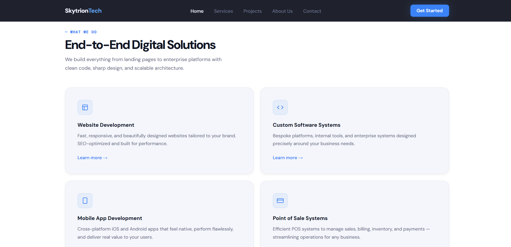
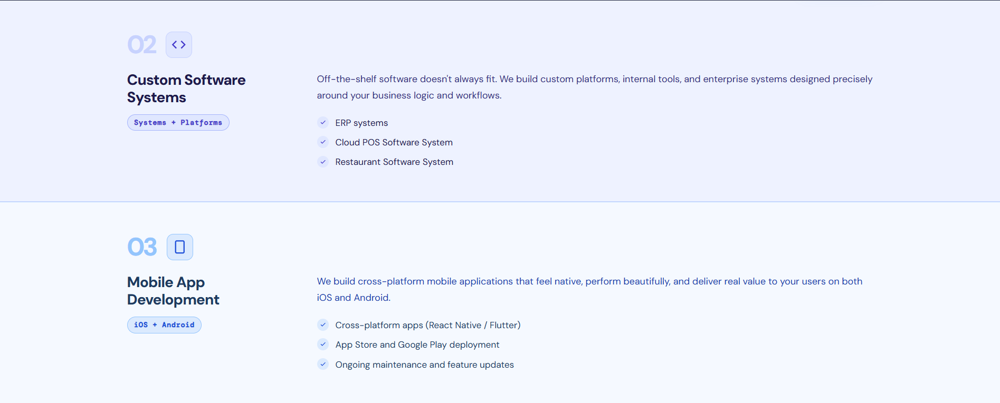
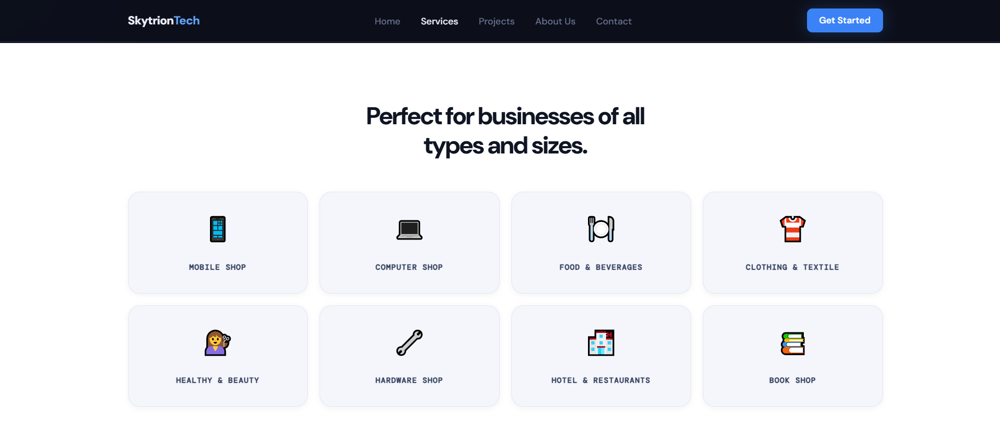

# Skytrion Tech

The company website for **Skytrion Tech**, a studio that designs and builds digital products: websites, custom software, mobile apps and point of sale (POS) systems.

## Pages

| Page | File | What it covers |
|------|------|----------------|
| Home | `index.html` | Hero, an overview of the four core services, and a call to action |
| About Us | `about.html` | Who we are and what makes us different |
| Services | `services.html` | Each service in detail, POS features and our process |
| Projects | `projects.html` | Portfolio of past client work |
| Contact | `contact.html` | Contact details and a message form |

## Screenshots

### Home





### About Us


### Services







### Projects


## Tech stack

- HTML and CSS for the site itself
- Java 11 with Jakarta EE (Servlet 5.0, JAX-RS 3.0, CDI 3.0)
- Maven, packaged as a `.war` file

## Project structure

```
Skytrion/
├── pom.xml
├── mvnw, mvnw.cmd
├── screenshots/
└── src/main/
    ├── resources/META-INF/beans.xml
    └── webapp/
        ├── index.html
        ├── about.html
        ├── services.html
        ├── projects.html
        └── contact.html
```

## Author

**Anthony Francis** ([@AnthonyFrancisSharu](https://github.com/AnthonyFrancisSharu))
